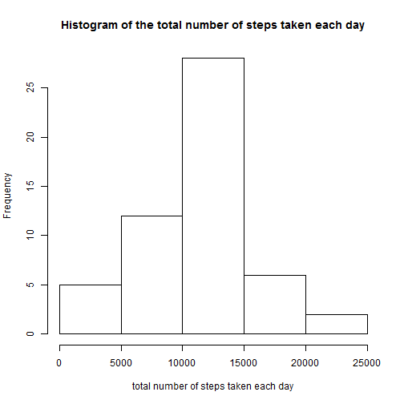
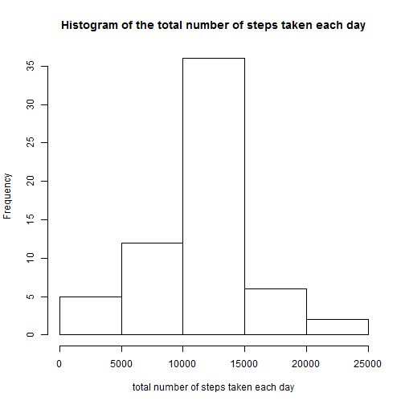
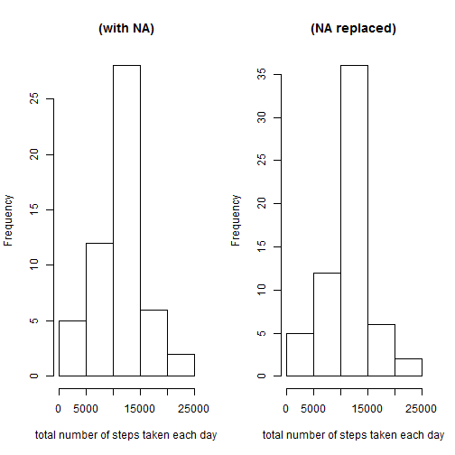

# Reproducible Research: Peer Assessment 1


## Loading and preprocessing the data

```r
activity <- read.csv("activity.csv")
activity$date <- as.Date(activity$date, format = "%Y-%m-%d")
```

## What is mean total number of steps taken per day?
# day dataframe with total steps per day

```r
day_df <- aggregate(activity$steps, by = list(activity$date), sum)
names(day_df)[1] <- "day"
names(day_df)[2] <- "steps"
```
# histogram of steps

```r
hist(day_df$steps, main = "Histogram of the total number of steps taken each day",
     xlab = "total number of steps taken each day")
```

 
# mean and median of steps

```r
mean(day_df$steps, na.rm = TRUE)
```

```
## [1] 10766
```

```r
median(day_df$steps, na.rm = TRUE)
```

```
## [1] 10765
```
## What is the average daily activity pattern?
# create total steps per interval dataframe
# create mean steps per interval dataframe

```r
# create total steps per interval dataframe
sum_int_df <- aggregate(activity$steps, by = list(activity$interval), sum, na.rm = TRUE, 
                         na.action = NULL)
names(sum_int_df)[1] <- "interval"
names(sum_int_df)[2] <- "steps"

mean_int_df <- aggregate(activity$steps, by = list(activity$interval), mean, na.rm = TRUE, 
                              na.action = NULL)
names(mean_int_df)[1] <- "interval"
names(mean_int_df)[2] <- "mean_steps"
```
#time series plot

```r
plot(mean_int_df$interval, mean_int_df$mean_steps, type = "n", main = "Time Series Plot per 5-minute interval", 
     xlab = "5-minute intervals", ylab = "Average number of steps taken")
lines(mean_int_df$interval, mean_int_df$mean_steps, type = "l")
```

 
# max steps

```r
mean_int_df[which.max(mean_int_df$mean_steps), 1]
```

```
## [1] 835
```
# Inputting missing values

```r
sum(is.na(activity$steps))
```

```
## [1] 2304
```

```r
mis_df <- merge(activity, mean_int_df, by = "interval", sort = FALSE)  # merge dataframes
mis_df <- mis_df[with(mis_df, order(date, interval)), ]  # sort on date and interval optional
```
# replace in steps column NA with value in mean_steps column

```r
mis_df$steps[is.na(mis_df$steps)] <- mis_df$mean_steps[is.na(mis_df$steps)]
mis_df$mean_steps <- NULL 

mis_df$steps <- round(mis_df$steps, digits = 0)
```
# New dataframe

```r
activity_new <- mis_df[, c(2, 3, 1)]
```
# new day dataframe with total steps per day

```r
newday_df <- aggregate(activity_new$steps, by = list(activity_new$date), sum)
names(newday_df)[1] <- "day"
names(newday_df)[2] <- "steps"
```
# histogram of steps

```r
hist(newday_df$steps, main = "Histogram of the total number of steps taken each day",
     xlab = "total number of steps taken each day")
```

 
# mean and median of steps

```r
mean(newday_df$steps, na.rm = TRUE)
```

```
## [1] 10766
```

```r
median(newday_df$steps, na.rm = TRUE)
```

```
## [1] 10762
```
# hist plot showing differences

```r
par(mfrow = c(1, 2))

hist(day_df$steps, main = "(with NA)", xlab = "total number of steps taken each day")

hist(newday_df$steps, main = "(NA replaced)", xlab = "total number of steps taken each day")
```

 
# new data frame

```r
newday_df2 <- activity_new
```
# create a factor with the names of the days for all dates

```r
newday_df2$weekdays <- factor(format(newday_df2$date, "%A"))

levels(newday_df2$weekdays)
```

```
## [1] "Friday"    "Monday"    "Saturday"  "Sunday"    "Thursday"  "Tuesday"  
## [7] "Wednesday"
```
# replace the levels

```r
levels(newday_df2$weekdays) <- list(weekday = c("Monday", "Tuesday", "Wednesday", "Thursday", "Friday"), weekend = c("Saturday", "Sunday"))
```

## Are there differences in activity patterns between weekdays and weekends?

```r
newday_df2_mean_int <- aggregate(newday_df2$steps, by = list(newday_df2$weekdays, newday_df2$interval), mean, na.rm = TRUE, na.action = NULL)
names(newday_df2_mean_int)[1] <- "weekday"
names(newday_df2_mean_int)[2] <- "interval"
names(newday_df2_mean_int)[3] <- "mean_steps"

library(lattice)
xyplot(newday_df2_mean_int$mean_steps ~ newday_df2_mean_int$interval | 
         newday_df2_mean_int$weekday, layout = c(1, 2), type = "l", xlab = "Interval", 
       ylab = "Number of steps")
```

 


